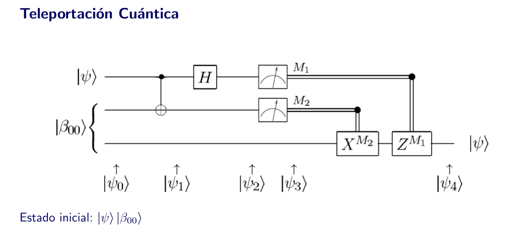
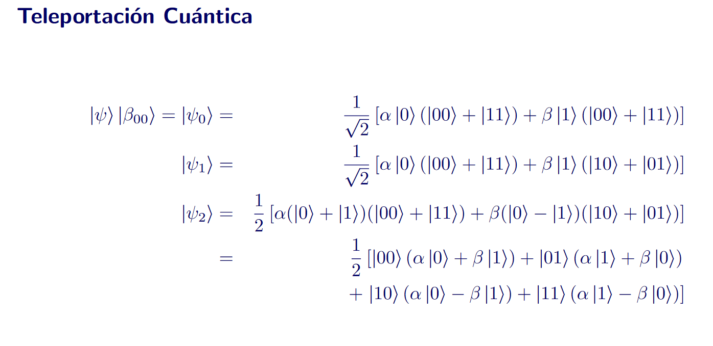
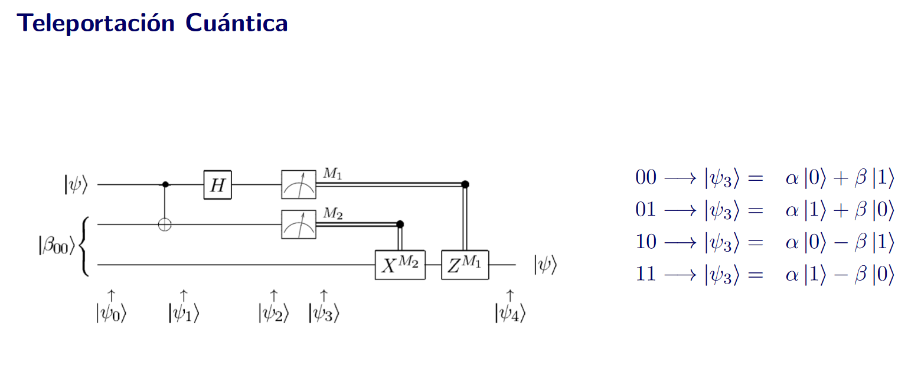

# 6

Demostración de Entrelazamiento no puede resultar de estados simples:
$(\alpha_0|0\rangle + \beta_0|1\rangle)(\alpha_1|0\rangle + \beta_1|1\rangle)= \frac{|00\rangle + |11\rangle}{2}$?

Empezamos desde dos estado simples
$$(\alpha_0|0\rangle + \beta_0|1\rangle)(\alpha_1|0\rangle + \beta_1|1\rangle)$$

$$=(\alpha_0\alpha_1|00\rangle + \alpha_0\beta_0|01\rangle)(\beta_0\alpha_1|10\rangle + \beta_0\beta_1|11\rangle)$$
Pero para alcanzar de un lado a otro debemos llegar a
$$= \frac{1}{\sqrt{2}}*|00\rangle + 0*|01\rangle+0*|10\rangle + \frac{1}{\sqrt{2}}*|11\rangle)$$debemos revisar posibles valores de $\alpha_i,\beta_j$
$\alpha_0\alpha_1=\frac{1}{\sqrt{2}}$
$\alpha_0\beta_1=0$
$\beta_0\alpha_1=0$
$\beta_0\beta_1=\frac{1}{\sqrt{2}}$

$i)$ suponemos $\alpha_0=0$, $\beta_1\ne0$,
 contradicción => $\alpha_0\ne0$
$i)$ suponemos $\beta_1=0$, $\alpha_0\ne0$,
 contradicción => $\beta_1\ne0$
$QED$

No es posible clonar un estado cuantico no conocido.

Se puede freaking teleportar, tho.

$\psi$

LSB =$\psi$
$|\beta_{00}\rangle=\frac{|00\rangle+|11\rangle}{\sqrt{2}}$
Estado inicial:$|\psi\rangle|\beta_{00}\rangle=|\psi_0\rangle$

$|\psi_2\rangle=1/2*(\alpha|000\rangle + \alpha |001\rangle + \beta|100\rangle - \beta|011\rangle+$
$\alpha|110\rangle + \alpha|111\rangle+\beta|100\rangle - \beta|101\rangle)$

$|\psi_3\rangle$ en 4 casos:

1. M1=0, M2 =0
 Solo quedan los estados
 $\frac{\alpha k|000\rangle+\beta k|100\rangle}{2}$ donde debe haber un $k$ que devuelva la norma 1. $k=2$ en este caso obtenemos el resultado $\alpha|000\rangle +\beta|100\rangle$
 y poniendolo bonito:
 
 $|\psi_4\rangle(\alpha|0\rangle + \beta|1\rangle)\otimes |00\rangle$
 
 No corre X, No corre Z
2. M1=0, M2 =1
  pasa $k=2$ y $(\beta|0\rangle + \alpha|1\rangle)\otimes |10\rangle$
  Corre X, No Z
  $|\psi_4\rangle=(\alpha|0\rangle + \beta|1\rangle)\otimes |10\rangle$

3. M1=1, M2=0
 pasa $k=2$ y $(\alpha|0\rangle - \beta|1\rangle)\otimes |01\rangle$
  No Corre X, Si Z
  $|\psi_4\rangle=(\alpha|0\rangle + \beta|1\rangle)\otimes |01\rangle$
  
1. M1=1, M2=1
 pasa $k=2$ y $(- \beta|0\rangle +\alpha|1\rangle)\otimes |11\rangle$
  Corre X, y Z
  $|\psi_4\rangle=(\alpha|0\rangle + \beta|1\rangle)\otimes |11\rangle$
